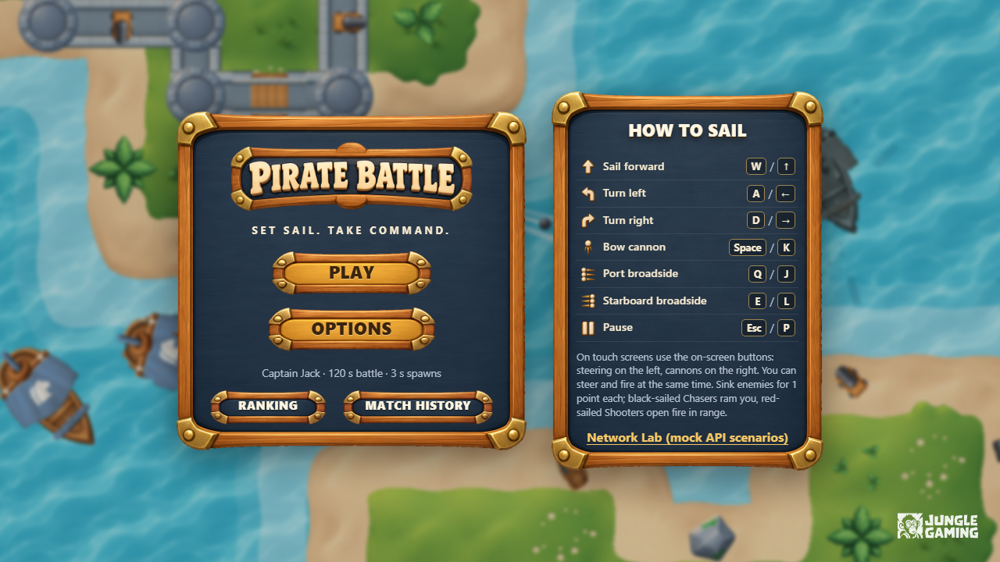
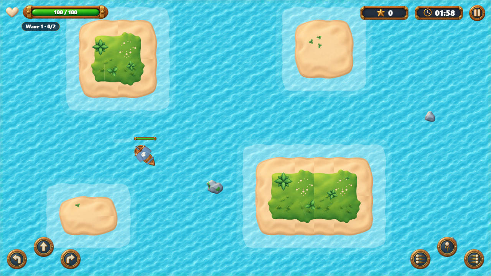
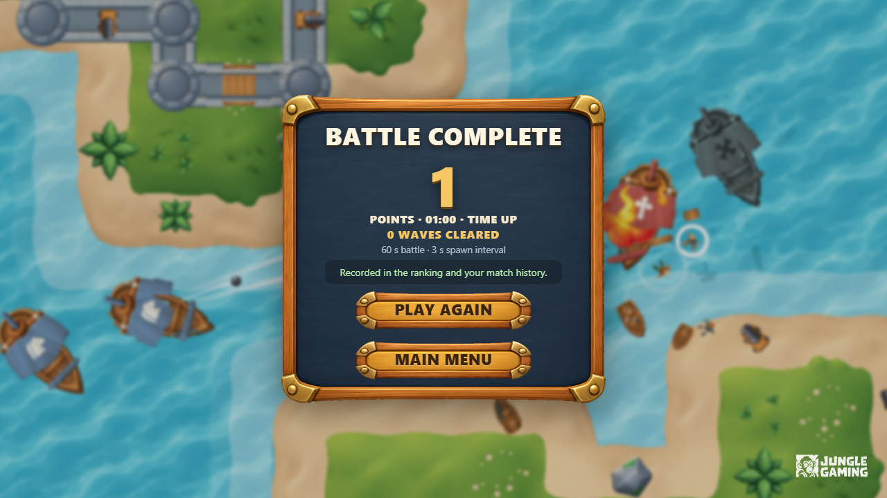

# Pirate Battle

A top-down 2D naval shooter built with **React, TypeScript (strict), PixiJS,
TanStack Query, Axios, MSW and Playwright**. Sail between islands, sink
Chasers and Shooters, and climb the ranking before the clock runs out.

> Live demo: **https://&lt;your-deployment&gt;.vercel.app** (see [Deploy](#deploy))
>
> Challenge brief: [docs/CHALLENGE.md](docs/CHALLENGE.md) · Design notes: [ARCHITECTURE.md](ARCHITECTURE.md) ·
> Performance: [docs/PERFORMANCE.md](docs/PERFORMANCE.md) · Assets and licenses: [docs/ASSETS.md](docs/ASSETS.md)

| Menu | Battle | Result |
| --- | --- | --- |
|  |  |  |

## Setup

Requirements: **Node.js 20.19+** (developed on 22.16) and npm. No backend,
services or secrets are needed: the ranking and history APIs are mocked with
MSW in every environment.

```bash
npm ci
npm run dev            # http://localhost:5173
```

End-to-end tests need the Playwright browser once:

```bash
npx playwright install chromium
```

## Commands

| Command | What it does |
| --- | --- |
| `npm run dev` | Vite dev server with HMR (React Strict Mode double-mounts) |
| `npm run build` | Type-check and production build into `dist/` |
| `npm run preview` | Serve the production build on http://localhost:4173 |
| `npm run lint` | ESLint (TypeScript, React Hooks rules) |
| `npm run typecheck` | `tsc -b` for the app and the Node/Playwright code |
| `npm run test:unit` | Vitest unit tests of the simulation |
| `npm run test:e2e` | Playwright suite (builds and starts the preview server automatically) |
| `npm run test:e2e:update` | Re-generate the visual baselines |
| `npm run test:e2e:report` | Open the last HTML report (traces of failed tests included) |
| `npm run perf` | Performance profile (needs `npm run preview` running), see [docs/PERFORMANCE.md](docs/PERFORMANCE.md) |
| `npm run prepare-assets` | Rebuild `public/assets` from `assets/` (needs ffmpeg for audio; output is committed) |

## Environment variables

The app itself needs none. Optional variables for tooling:

| Variable | Used by | Effect |
| --- | --- | --- |
| `E2E_BASE_URL` | Playwright | Run against an existing server (e.g. `http://localhost:5173` for the dev server) instead of building and previewing |
| `CI` | Playwright | 2 workers, 1 retry, `test.only` forbidden |
| `PERF_URL`, `PERF_SECONDS`, `PERF_CYCLES`, `PERF_HEADLESS`, `PERF_CHANNEL`, `PERF_GPU` | `npm run perf` | See the header of `perf/profile.mjs` |
| `BALANCE=1` | Vitest | Prints the balancing bench (`src/game/sim/__bench__`) |

## Controls

Controls are listed on the main menu ("How to sail") and in the pause dialog.
Keyboard and touch work at the same time, and you can move and fire
simultaneously.

| Action | Keyboard | Touch |
| --- | --- | --- |
| Sail forward | `W` / `↑` | ⬆ (left pad) |
| Turn left / right | `A` `D` / `←` `→` | ↶ ↷ (left pad) |
| Bow cannon (1 ball) | `Space` / `K` | center button (right pad) |
| Port broadside (3 balls, left) | `Q` / `J` | left button (right pad) |
| Starboard broadside (3 balls, right) | `E` / `L` | right button (right pad) |
| Pause / resume | `Esc` / `P`, pause button | pause button |

The game pauses by itself when the window loses focus or the tab is hidden;
resuming always needs an action. On phones the game is **landscape only**; in
portrait a "rotate your device" notice is shown.

**Rules:** each enemy you sink scores 1 point (a Chaser that rams you does not
score). The match ends when the time runs out or your ship sinks.

| Enemy | Sails | Behaviour |
| --- | --- | --- |
| Chaser | black | Hunts you and explodes on impact; sometimes loses interest for a moment |
| Chaser, drifter | white | Wanders until you come close (or shoot it), then hunts |
| Chaser, sprinter | small, reddish black | Fast and fragile |
| Shooter | red | Closes in, holds about 300 px away and fires its bow cannon |
| Shooter, flanker | green | Circles you and only fires sideways (two-ball broadsides) |
| Shooter, sentinel | yellow | Sails to a guard post, holds it and fires from long range |

Enemies have a rolled temperament (reaction time, aim error), so they are not
perfect aimbots.

### Beyond the brief: power-ups and waves

- **Power-ups.** Every enemy you sink drops a floating badge that sinks after
  8 s. Sail over it to collect it. The permanent upgrades stack for the rest of
  the match and reset when a new match starts:
  **Heavy shot** (+15% damage, up to 5), **Quick reload** (+10% fire rate,
  up to 4), **Fan shot** (+2 bow balls, up to 2). **Repair kit** restores 20 hull
  and is also what a maxed upgrade turns into.
- **Waves.** Wave 1 needs 2 kills, then 4, 6, 8… Clearing a wave shows
  "Wave N cleared!", heals 15, grants a free upgrade and sinks the remaining
  enemies (no points), and the next wave starts. Every wave adds one enemy to
  the on-screen limit and makes enemies 35% tougher and harder-hitting.
- The rules of the brief are unchanged: 1 point per sunk enemy, spawns at the
  configured interval, and the match ends only by time or by sinking. The
  number of waves cleared is shown on the result screen and in the match
  history.

## Gameplay configuration

All balancing values are in one typed, documented object: `DEFAULT_CONFIG` in
[`src/game/config.ts`](src/game/config.ts). Changing a number never requires
touching the systems. Each match runs on a frozen snapshot, so changes in
Options only affect the next match.

| Group | Values |
| --- | --- |
| Match | `sessionTime` (from Options), `fixedStep`, `maxFrameDelta`, `endDelay`, `seed` |
| Player | health, max speed, acceleration, drag, turn speed, hull size; `frontCannon` and `broadside` (damage, projectile speed, range, lifetime, cooldown, radius, count, spacing) |
| Chaser | hull values and `impactDamage` |
| Shooter | hull values, `attackRange`, `preferredDistance`, `aimTolerance`, `weapon` |
| Spawn | `interval` (from Options), `initialDelay`, `weights`, `variants` (weight, sail colour and stat patch per variant), `openingSequence`, `points`, `minPlayerDistance`, `maxAlive`, `spawnGrace` |
| Temperament | reaction-time range, aim-error range, chance and duration of chasers losing interest |
| Power-ups | drop chance, lifetime, pickup radius, weights, max stacks, effect per stack, repair amount |
| Waves | first target, increment, reward heal and upgrade, board clear, enemy health/damage/count scaling per wave |

Options screen limits (`OPTION_LIMITS`):

| Option | Range | Step | Default |
| --- | --- | --- | --- |
| Game session time | 60 to 180 s (whole seconds) | 10 s with the steppers | 120 s |
| Enemy spawn time | 1 to 10 s (positive; 0.5 s steps) | 0.5 s | 3 s |

Options, captain name and sound are validated, saved to localStorage and
restored after a refresh. See [ARCHITECTURE.md §13](ARCHITECTURE.md#13-balancing-decisions)
for the balancing rationale.

## Network scenarios (mock API)

Open **Network Lab** from the main menu (the link under "How to sail"), or add
`?scenario=<id>` to the URL. The choice is persisted, so it survives refreshes.
**Reset** restores the default scenario and the initial fixtures. The lab also
sets the client timeout (2 to 10 s, default 6 s).

`default` · `empty` · `many-pages` · `slow` · `variable-latency` ·
`out-of-order` · `timeout` · `network-error` · `server-error` ·
`client-error` · `ranking-fails` · `history-fails` ·
`submit-timeout-after-commit` · `offline-on-submit`. The table in
[ARCHITECTURE.md §10](ARCHITECTURE.md#10-msw-mocks) describes each one.

### Reproducing failures

| To see… | Do this |
| --- | --- |
| Loading, empty and paging states | Scenarios `slow`, `empty`, `many-pages`, then open Ranking / Match History |
| A failing tab with the other one working | `ranking-fails` or `history-fails` |
| Automatic retries, then an error with "Try again" | `server-error` or `network-error` (retried) vs `client-error` (not retried) |
| Out-of-order responses not overwriting fresh data | `out-of-order`, open Match History, finish a match or change pages quickly |
| Timeout after the server saved the match (no duplicate) | `submit-timeout-after-commit`, lab timeout 2 s, finish a match: "Recording…" becomes "Recorded", and history shows one row |
| Server down at the end of a match, recovery later | `offline-on-submit`, finish a match: "Could not record… Retry now"; refresh (the record is still pending, see the banner on the menu); switch to `Success` and press **Retry now** |
| Texture loading failure | DevTools → Network → block `ships.png`, press Play: an error with **Retry** appears; unblock and retry |
| Collider debug view | `localStorage.setItem('pb.debug.colliders','true')` and start a match |

## Tests

```bash
npm run test:unit
npm run test:e2e                     # desktop Chromium (all) + mobile Chromium (@core flows)
npx playwright test --project=desktop-chromium e2e/04-combat.spec.ts
E2E_BASE_URL=http://localhost:5173 npx playwright test --project=desktop-chromium   # against `npm run dev`
npm run test:e2e:report
```

| Area (brief §8) | Spec |
| --- | --- |
| 1. Options navigation, validation, persistence | `e2e/01-options.spec.ts` |
| 2. Asset loading, failure, retry | `e2e/02-assets.spec.ts` |
| 3. Start, movement, rotation, arena limits, islands | `e2e/03-movement.spec.ts` |
| 4. Front and side cannons, damage, cooldown, score without duplicates | `e2e/04-combat.spec.ts` |
| 5. Chaser and Shooter behaviour, spawn interval | `e2e/05-enemies.spec.ts` |
| 6. End by time and by death, frozen simulation, clean restart | `e2e/06-match-end.spec.ts` |
| 7. Pause, focus loss, resume without catch-up | `e2e/07-pause.spec.ts` |
| 8. Result screen and persistence after refresh | `e2e/08-result.spec.ts` |
| 9. Abandoning, repeated navigation, touch controls | `e2e/09-navigation.spec.ts` |
| 10. Ranking and history: queries, paging, loading, empty, error | `e2e/10-log.spec.ts` |
| 11. Registration, both tabs updated, pending record after refresh | `e2e/11-registration.spec.ts` |
| 12. Resubmission after timeout, late responses | `e2e/12-resilience.spec.ts` |
| Beyond the brief: power-ups and waves | `e2e/13-progression.spec.ts` |
| Visual regression (menu, arena, result) | `e2e/visual.spec.ts` |

How the tests stay reproducible:

- Every test runs in a fresh browser context with seeded localStorage: fixed
  profile and settings, mock scenario, zero mock latency unless latency is
  under test.
- The simulation runs on the **manual clock**: time only advances through
  `window.__PIRATE__.advance(ms)`, in whole fixed steps.
- Combat is driven through the real keyboard and touch controls. Config
  overrides (`pb.test.overrides`) place enemies deterministically.
- The HTML report is written to `playwright-report/` and traces, screenshots
  and videos of failures to `test-results/`.
- Visual baselines are versioned in `e2e/__screenshots__/<project>/` and were
  generated on Windows; on another OS run `npm run test:e2e:update` first.

## Performance

In the optimised build on the reference machine (i7-13700HX with Intel UHD
Graphics, headless Chromium using the GPU), a 3-minute match averages the
target 60 FPS. The full numbers, the memory check over 5 play/leave cycles and
the method are in [docs/PERFORMANCE.md](docs/PERFORMANCE.md).

## Deploy

The build is a static site and needs no server configuration: routing uses the
URL hash and the MSW worker is served from `public/`.

**Vercel** (recommended; `vercel.json` is included):

```bash
npm i -g vercel
vercel login
vercel --prod        # framework: Vite, build: npm run build, output: dist
```

Or import the Git repository in the Vercel dashboard (defaults are detected).
Netlify and Cloudflare Pages also work: build command `npm run build`, publish
directory `dist`.

## Project structure

```
assets/            original challenge assets (source of public/assets)
public/assets/     runtime atlases, UI images and MP3 sounds (generated, committed)
public/mockServiceWorker.js
src/game/          simulation, rendering, input, session, config, audio
src/ui/            React app, screens, components, styles
src/api/           contracts, Axios client, TanStack Query hooks
src/state/         localStorage-backed settings, profile, last result, outbox
src/mocks/         MSW handlers, mock database, fixtures, scenarios
src/testing/       test and profiling hooks
e2e/               Playwright specs, fixtures and visual baselines
perf/              profiling script and results
scripts/           asset preparation
```

## Reports

- `reports/playwright-report/`: HTML report of the last full E2E run (93 tests, desktop and mobile). Open `index.html`, or run `npx playwright show-report reports/playwright-report`.
- `reports/unit-tests.txt`: Vitest output.
- `perf/results/`: profiling summaries and raw JSON (see [docs/PERFORMANCE.md](docs/PERFORMANCE.md)).
